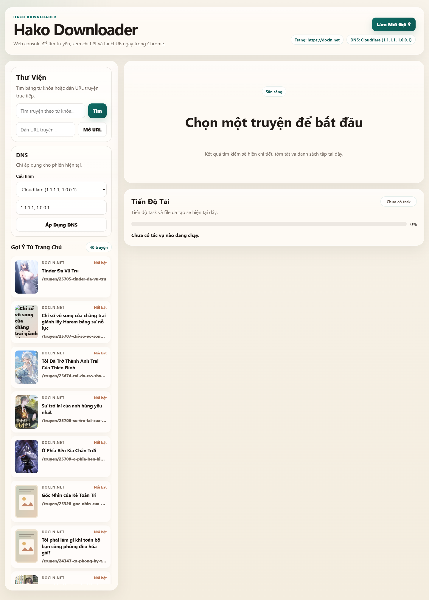
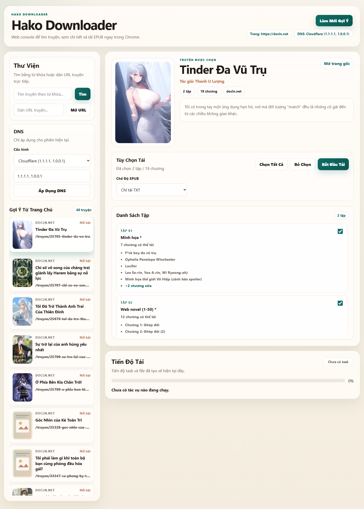

# Hako Downloader

Hako Downloader là công cụ local để tìm và tải Light Novel từ hệ sinh thái Hako / DocLN. Dự án có web UI chạy trên Chrome và vẫn giữ CLI cũ khi cần.

## Tính năng

- Tìm truyện theo từ khóa
- Gợi ý truyện từ trang chủ
- Xem ảnh bìa, tóm tắt và danh sách tập
- Chọn tập cần tải
- Xuất TXT và EPUB
- Đổi DNS ngay trong ứng dụng
- Theo dõi tiến độ tải trên giao diện web
- Có thể quay lại CLI bằng `npm run cli`

## Yêu cầu

- Node.js 20+
- npm

## Cài đặt

```bash
npm install
```

## Chạy web UI

```bash
npm start
```

Sau đó mở:

- [http://localhost:3000](http://localhost:3000)

Terminal lúc này sẽ chạy backend local. Giao diện web là nơi thao tác chính.

## Chạy CLI cũ

```bash
npm run cli
```

## Cách dùng nhanh

1. Chạy `npm start`
2. Mở `http://localhost:3000`
3. Tìm truyện bằng từ khóa hoặc dán URL truyện trực tiếp
4. Chọn truyện từ danh sách bên trái
5. Chọn chế độ tải:
   - `Chỉ tải TXT`
   - `1 EPUB tổng`
   - `EPUB từng tập`
   - `Cả hai`
6. Chọn các tập muốn tải
7. Bấm `Bắt Đầu Tải`

Sau khi tải xong:

- TXT / HTML cache nằm trong `downloads/`
- EPUB có thể tải trực tiếp từ giao diện web

## DNS tùy chỉnh

Ung dụng hỗ trợ các lựa chọn DNS sau:

- `Hệ thống mặc định`
- `Cloudflare`
- `Google`
- `Tự nhập`

Thiết lập này chỉ áp dụng cho app hiện tại, không thay đổi DNS toàn máy.

## Cấu trúc chính

```text
.
|- public/        # giao diện web
|- server.js      # backend local
|- index.js       # CLI cũ
|- downloads/     # file tải về và cache
`- output/        # ảnh / artifact debug
```

## Scripts

```json
{
  "start": "node server.js",
  "web": "node server.js",
  "cli": "node index.js"
}
```

## Ảnh Chụp Màn Hình

Giao diện web local của ứng dụng trên trình duyệt.

### Trang chủ



### Trang chi tiết




## Lưu ý

- Đây là công cụ chạy local, không phải dịch vụ public
- Tốc độ tải phụ thuộc vào site nguồn và giới hạn mạng
- Nếu cấu trúc HTML của site thay đổi, app có thể cần cập nhật selector
